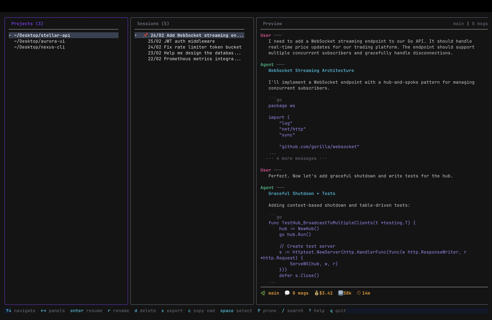

# cc-vault

A lazygit-style TUI for browsing and managing your [Claude Code](https://claude.ai/claude-code) sessions.




## Features

- **Three-panel layout** — Projects, Sessions, and Preview side-by-side
- **Session preview** — Scrollable markdown-rendered conversation view
- **Resume sessions** — Press Enter to jump straight into a session with `claude --resume`
- **Rename** — Native integration with Claude Code's rename system (`/rename` compatible)
- **Search** — Full-text search across all session content
- **Bulk operations** — Select multiple sessions for delete or export
- **Prune** — Clean up empty sessions with zero messages
- **Export** — Save sessions as readable markdown files

## Install

**Download binary** from [GitHub Releases](https://github.com/Adithyan777/cc-vault/releases) — pick the right one for your OS/arch, then:

```bash
tar xzf cc-vault_*.tar.gz
sudo mv cc-vault /usr/local/bin/
```

**Or install with Go:**

```bash
go install github.com/Adithyan777/cc-vault@latest
```

**Or build from source:**

```bash
git clone https://github.com/Adithyan777/cc-vault.git
cd cc-vault
go build -o cc-vault .
sudo mv cc-vault /usr/local/bin/
```

Available for macOS and Linux (amd64 + arm64). Requires [Claude Code](https://docs.anthropic.com/en/docs/claude-code) installed.

**Tip:** Add a short alias to your shell config (`~/.zshrc` or `~/.bashrc`):

```bash
alias ccv="cc-vault"
```

## Usage

```bash
cc-vault
```

Navigate with familiar vim-style keybindings:

| Key | Action |
|-----|--------|
| `j/k` `↑/↓` | Navigate within panel |
| `h/l` `←/→` | Switch panels |
| `Enter` | Resume selected session |
| `r` | Rename session |
| `d` | Delete session |
| `x` | Export to markdown |
| `Space` | Toggle select |
| `D` | Bulk delete selected |
| `X` | Bulk export selected |
| `P` | Prune empty sessions |
| `/` | Search sessions |
| `?` | Help |
| `q` | Quit |

## How it works

cc-vault reads Claude Code's local data directly from `~/.claude/`:

- **Projects** discovered from `~/.claude/projects/` directory structure
- **Sessions** parsed from JSONL files with fast partial reads (first 30 lines for metadata, last 8KB for custom titles)
- **Renames** written as native `custom-title` JSONL entries — fully compatible with `claude --resume "name"` and `/rename`

## Built with

- [Bubble Tea](https://github.com/charmbracelet/bubbletea) — TUI framework
- [Lip Gloss](https://github.com/charmbracelet/lipgloss) — Terminal styling

## License

MIT
